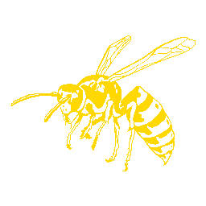

> [!IMPORTANT]
> [W4SP, as it is now, is very unlikely to recieve further development.](https://github.com/JaegerwaldDev/W4SP/issues/4)

 
 
 
A git-based static MediaWiki alternative
 
 
 

## Features
- Configurable
- Entirely client-side, aside from the git repository
- Markdown format
- Custom `<page-link>` element to refer to other Wiki pages
- Modular Special pages

zoid & jae were here
